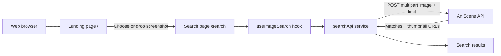

<p align="center">
  
</p>

<h1 align="center">AniScene</h1>

<p align="center">Find anime scenes from screenshots.</p>

<p align="center">
  
  
  
  
  
  
  
</p>

AniScene is a focused visual-search tool for anime. Upload a screenshot and the app searches the existing AniScene API for matching anime scenes, episodes, timestamps, and thumbnails.

## Showcase

<video src="./assets/record/showcase.mp4" controls width="100%"></video>

The web MVP includes a landing page, fullscreen screenshot drop interaction, `/search` flow, result cards, FAQ accordion, responsive layout, and a shared React Native component structure ready for a future Android client.

## Architecture



The frontend is split into reusable layers:

```text
App.tsx
└── src/
    ├── components/       UI components and page sections
    ├── hooks/             Search state and interaction flow
    ├── services/          Backend API client
    ├── theme/             Brand colors, spacing, typography
    ├── types.ts           Shared image and result types
    └── web/               Web metadata and web-only helpers
```

## Tech stack

- Expo for project tooling and web export.
- React Native for shared UI primitives.
- React Native Web for the initial browser experience.
- TypeScript for typed components, API data, and shared models.
- Lucide React Native for cross-platform icons.
- Vercel for static web deployment.
- Existing AniScene FastAPI API for screenshot search.

## Getting started

Requirements: Node.js 20+ and npm.

```bash
npm ci
cp .env.example .env
npm run web
```

The app runs on Expo's available local web port. The API URL can be changed in `.env`:

```env
EXPO_PUBLIC_API_URL=https://anisceneapi.fhanalabs.site
```

For a local backend, use the local API URL and allow the frontend origin in backend CORS configuration.

## API flow

The search screen sends:

```http
POST /api/v1/search?limit=10
Content-Type: multipart/form-data
```

The uploaded field is named `image`. The frontend renders the API's `anime`, `episode`, `scene`, `match`, and `thumbnail_url` fields without exposing internal vector data.

## Deploy to Vercel

The repository includes `vercel.json` with the required settings:

```text
Install command: npm ci
Build command: npm run build
Output directory: dist
```

Set this environment variable in Vercel:

```text
EXPO_PUBLIC_API_URL=https://anisceneapi.fhanalabs.site
```

The backend must allow the deployed frontend origin through CORS:

```text
https://aniscene.fhanalabs.site
```

## Scripts

```bash
npm run web        # Start Expo web development server
npm run typecheck  # Run TypeScript checks
npm run build      # Export the web app to dist/
```

## License

This frontend is developed for AniScene by FhanaLabs.
